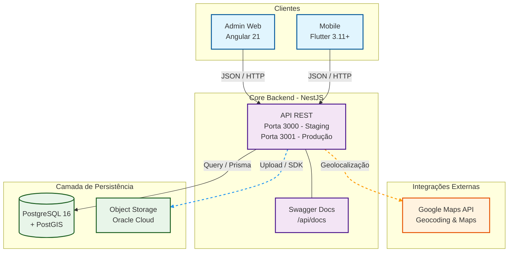
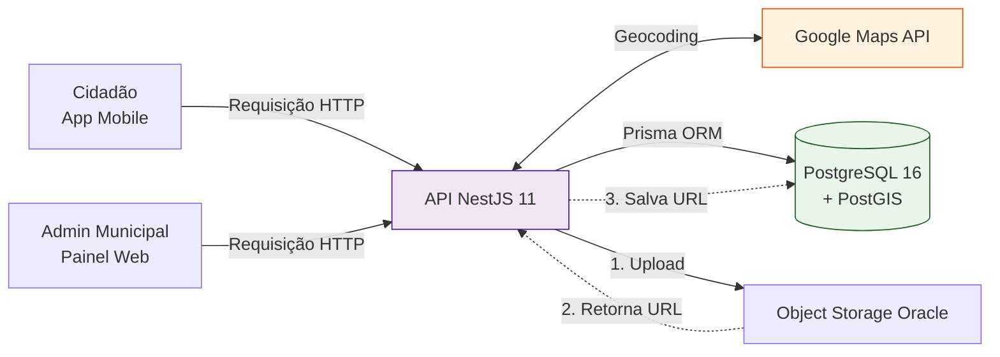

# Arquitetura do Conecta Paraná

## Visão geral

O Conecta Paraná é um monorepo com três frentes que se comunicam através de uma API REST centralizada.



## Stack por frente

| Frente | Tecnologias principais |
|---|---|
| **Backend** | NestJS 11, TypeScript, Prisma 7 (PrismaPg adapter), PostGIS, Swagger, Jest, Stryker |
| **Admin** | Angular 21 (standalone components), TypeScript, Tailwind CSS, Vite, Jasmine + Karma, Playwright, Stryker |
| **Mobile** | Flutter 3.11+, Dart
| **Infra** | Docker, Docker Compose, PostgreSQL 16 + PostGIS, GHCR, GitHub Actions |

## Fluxo de dados



## Ambientes

| Ambiente | Compose file | Descrição |
|---|---|---|
| **Local** | `docker-compose.yml` | Desenvolvimento com hot reload. Backend na porta 3000, admin na 4200, banco na 5432. |
| **Staging** | `docker-compose.staging.yml` | Imagens pré-construídas do GHCR com tag `:staging`. Deploy manual via GitHub Actions. |
| **Produção** | `docker-compose.production.yml` | Imagens do GHCR com tag `:latest`. Deploy automático ao mergear PR na `main`. |

## Deploy

- **Registry:** GitHub Container Registry (GHCR)
- **Plataforma:** Linux/arm64 (build via QEMU + Buildx)
- **Servidor:** VM acessada via SSH

## Estrutura do monorepo

```
conecta-parana/
├── backend/             # API NestJS + Prisma
├── admin/               # Painel web Angular
├── mobile/              # App Flutter
├── infra/               # Dockerfile do banco (PostGIS)
├── docs/                # Documentação do projeto
├── .github/workflows             # CI/CD pipelines
├── docker-compose.yml            # Local
├── docker-compose.staging.yml    # Staging
└── docker-compose.production.yml # Produção
```
