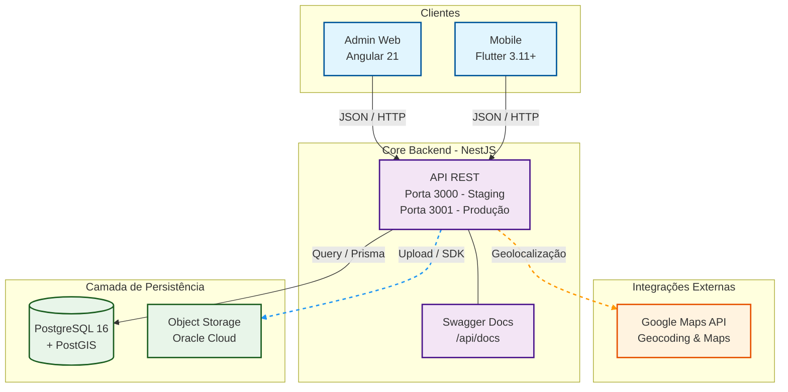
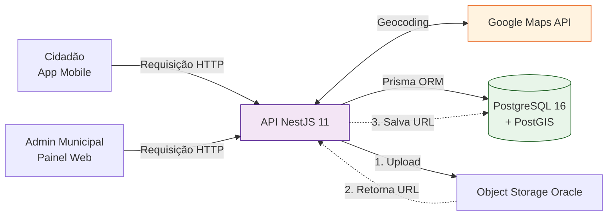

# Arquitetura do Conecta Paraná

## Visão geral

O Conecta Paraná é um monorepo com três frentes que se comunicam através de uma API REST centralizada.


```mermaid
graph TD
    %% Definição de Estilos
    classDef infra fill:#f9f,stroke:#333,stroke-width:2px;
    classDef client fill:#e1f5fe,stroke:#01579b,stroke-width:2px;
    classDef server fill:#f3e5f5,stroke:#4a148c,stroke-width:2px;
    classDef database fill:#e8f5e9,stroke:#1b5e20,stroke-width:2px;
    classDef external fill:#fff3e0,stroke:#e65100,stroke-width:2px;

    subgraph Clientes [Clientes]
        MOBILE[Mobile<br/>Flutter 3.11+]:::client
        ADMIN[Admin Web<br/>Angular 21]:::client
    end

    subgraph External [Integrações Externas]
        GMAPS[Google Maps API<br/>Geocoding & Maps]:::external
    end

    subgraph Backend [Core Backend - NestJS]
        API[API REST<br/>Porta 3000 - Staging<br/>Porta 3001 - Produção]:::server
        SWAGGER[Swagger Docs<br/>/api/docs]:::server
    end

    subgraph Dados [Camada de Persistência]
        DB[(PostgreSQL 16<br/>+ PostGIS)]:::database
        OBJ[Object Storage<br/>Oracle Cloud]:::database
    end

    %% Fluxos de Comunicação
    MOBILE -- "JSON / HTTP" --> API
    ADMIN -- "JSON / HTTP" --> API
    
    API -- "Query / Prisma" --> DB
    API -. "Upload / SDK" .-> OBJ
    API -- "Geolocalização" --> GMAPS
    
    API --- SWAGGER

    %% Notas de implementação
    linkStyle 4 stroke:#ff9800,stroke-width:2px,stroke-dasharray: 5 5;
    linkStyle 3 stroke:#2196f3,stroke-width:2px,stroke-dasharray: 5 5;
```

## Stack por frente

| Frente | Tecnologias principais |
|---|---|
| **Backend** | NestJS 11, TypeScript, Prisma 7 (PrismaPg adapter), PostGIS, Swagger, Jest, Stryker |
| **Admin** | Angular 21 (standalone components), TypeScript, Tailwind CSS, Vite, Jasmine + Karma, Playwright, Stryker |
| **Mobile** | Flutter 3.11+, Dart
| **Infra** | Docker, Docker Compose, PostgreSQL 16 + PostGIS, GHCR, GitHub Actions |

## Fluxo de dados


```mermaid
flowchart LR
    %% Clientes
    A[Cidadão<br/>App Mobile] -->|Requisição HTTP| B
    C[Admin Municipal<br/>Painel Web] -->|Requisição HTTP| B

    %% Backend com Portas
    B[API NestJS 11]

    %% Processamento Geográfico
    B <-->|Geocoding| G[Google Maps API]

    %% Persistência e Upload
    B -->|Prisma ORM| D[(PostgreSQL 16<br/>+ PostGIS)]
    B -->|1. Upload| E[Object Storage Oracle]
    E -.->|2. Retorna URL| B
    B -.->|3. Salva URL| D

    %% Estilos
    style B fill:#f3e5f5,stroke:#4a148c
    style D fill:#e8f5e9,stroke:#1b5e20
    style G fill:#fff3e0,stroke:#e65100
```

## Padrão de Identificadores (ULIDs)

Todas as chaves primárias do sistema utilizam ULIDs (Universally Unique Lexicographically Sortable Identifier) prefixados no formato `prefix_01HZX...`. Esta estrutura garante identificadores globais, únicos, ordenáveis e type-safe na manipulação de chaves entre front-end e back-end.

A tabela abaixo define a Fonte de Verdade para o mapeamento Entidade para Prefixo:

| Model / Entidade | Prefixo ULID | Exemplo |
|---|---|---|
| User | `usr_` | `usr_01H...` |
| City | `cit_` | `cit_01H...` |
| Event | `evt_` | `evt_01H...` |
| Post | `pst_` | `pst_01H...` |
| News | `nws_` | `nws_01H...` |
| Local | `loc_` | `loc_01H...` |
| Category | `cat_` | `cat_01H...` |
| HealthCheck | `hlt_` | `hlt_01H...` |
| Suggestion | `sgt_` | `sgt_01H...` |
| Notification | `nfy_` | `nfy_01H...` |
| Like | `lke_` | `lke_01H...` |
| Favorite | `fav_` | `fav_01H...` |
| Photo | `pho_` | `pho_01H...` |
| RefreshToken | `rfk_` | `rfk_01H...` |

## Ambientes

| Ambiente | Compose file | Descrição |
|---|---|---|
| **Local** | `docker-compose.yml` | Desenvolvimento com hot reload. Backend na porta 3000, admin na 4200, banco na 5432. |
| **Staging** | `docker-compose.staging.yml` | Imagens pré-construídas do GHCR com tag `:staging`. Deploy manual via GitHub Actions. |
| **Produção** | `docker-compose.production.yml` | Imagens do GHCR com tag `:latest`. Deploy automático ao mergear PR na `main`. |

## Deploy

- **Registry:** GitHub Container Registry (GHCR)
- **Plataforma:** Linux/ARM64
- **Servidor:** VM acessada via SSH

## Autorização: roles e escopo por cidade

O enum `Role` tem apenas dois valores: `ADMIN` e `CIDADAO`. O Super Admin não é uma role separada: é um `ADMIN` cujo JWT tem `cityId = null`. O JWT carrega `sub`, `email`, `role` e `cityId` (pode ser `null`).

### Personas

| Persona | role | cityId no JWT | Escopo |
|---|---|---|---|
| Cidadão | `CIDADAO` | qualquer / null | Operações públicas e o próprio perfil |
| Admin municipal | `ADMIN` | `cit_XXX` | Escrita restrita à própria cidade |
| Super Admin | `ADMIN` | `null` | Qualquer cidade (deve informar `cityId` no payload) |

### Guards

- `JwtAuthGuard`: autentica (401 `unauthenticated`).
- `RolesGuard` (`@Roles(...)`): exige a role do endpoint (403 `role_denied`).
- `CityScopeGuard` (`@RequireCityScope({ source?, field? })`): aplica o escopo de cidade. Lê o `cityId` do ator no JWT e o `cityId` alvo do request (`body`/`params`/`query`, padrão `body.cityId`). Roda após o `JwtAuthGuard`.

### Matriz de permissões (CityScopeGuard)

| Persona | cityId alvo | Resultado |
|---|---|---|
| Cidadão (`CIDADAO`) | qualquer | Liberado (escopo não se aplica; role tratada pelo `@Roles`) |
| Super Admin | ausente | 400 `city_required` |
| Super Admin | informado | Liberado |
| Admin municipal | igual à própria cidade ou ausente | Liberado |
| Admin municipal | diferente da própria cidade | 403 `city_scope_denied` |

### Códigos de erro (contrato backend)

O backend devolve `{ code, message }`: `code` é o identificador de máquina; `message` é o motivo em PT-BR. O `/admin` mapeia o `code` para a mensagem ao usuário (mapa próprio e independente).

| Code | HTTP | Quando |
|---|---|---|
| `unauthenticated` | 401 | Token ausente, inválido ou expirado |
| `role_denied` | 403 | Role insuficiente para o endpoint |
| `city_scope_denied` | 403 | Admin municipal atuando em recurso de outra cidade |
| `city_required` | 400 | Super Admin sem informar `cityId` no payload |

### Web Admin: rotas e guards

O JWT é decodificado no cliente (`admin/src/app/shared/utils/jwt.ts`) apenas para roteamento e UI condicional; toda autorização de fato continua no backend (`RolesGuard`/`CityScopeGuard`). O `cityId` não vem em `/auth/me`, então o `AuthService` o extrai do access token.

Guards funcionais em `core/guards/auth.guard.ts`:

| Rota | Guard exigido | Ao negar |
|---|---|---|
| `/` (visitante) | `unauthenticatedGuard` (`CanMatch`) | Já autenticado: o match falha e o roteador cai no shell (área logada) |
| Shell: `/posts`, `/events`, `/news`, `/locals`, `/notifications`, `/dashboard` | `authenticatedGuard` e `adminGuard` | Sem sessão: vai para `/` com `returnUrl`. Sem ADMIN: toast, logout e volta para `/` |
| `/admins` | `superAdminGuard` (além de authenticated e admin) | ADMIN municipal: toast e redireciona para `/dashboard` |

O login é servido na raiz (`/`), não em `/login`. `/dashboard` é um atalho que redireciona para `/posts`.

> Os tokens ficam em `localStorage` quando "Lembrar-me" está marcado, senão em `sessionStorage`. Se o storage escolhido estiver indisponível, o `AuthService` cai para `sessionStorage` com aviso silencioso no console.

## Mapeamento HTTP para comportamento UI (web-admin)

O `error.interceptor.ts` normaliza todos os erros HTTP em um objeto `AppError { status, message, details }` e decide se dispara um Toast ou repassa silenciosamente ao componente.

### Resolução de mensagem (ordem de prioridade)

1. `error.error?.code` - `ERROR_CODE_MAP`
2. `error.status` - `STATUS_MAP`
3. Fallback genérico

### Tabela de comportamento por status

| Status | Toast PT-BR | Repassado ao componente |
|---|---|---|
| 401 (chamada autenticada) | "Sessão expirada, faça login novamente." (apenas se refresh falhar) | Não - refresh automático transparente |
| 400 | Nenhum | Sim - `AppError` com `details` para destacar campos no form |
| 403 | "Acesso negado." | Sim - `AppError` |
| 404 | Nenhum | Sim - `AppError` com `details` para exibir "não encontrado" |
| 429 | Mensagem vinda do backend (`error.error.message`) | Sim - `AppError` |
| 5xx | "Erro do servidor. Tente novamente em instantes." | Sim - `AppError` |
| 0 / rede | "Sem conexão com o servidor." + botão "Tentar novamente" | Sim - `AppError` |

Codes planejados:

| Code | Status HTTP | Mensagem PT-BR |
|---|---|---|
| `unauthenticated` | 401 | "Sessão expirada, faça login novamente." |
| `role_denied` | 403 | "Acesso negado para este papel." |
| `city_scope_denied` | 403 | "Você só pode atuar na sua cidade." |
| `validation_failed` | 400 | Passthrough sem toast |
| `too_many_attempts` | 429 | Mensagem vinda do backend |

---

## Estrutura do monorepo

```
conecta-parana/
├── backend/             # API NestJS + Prisma
├── admin/               # Painel web Angular
├── mobile/              # App Flutter
├── infra/               # Dockerfile do banco (PostGIS)
├── docs/                # Documentação do projeto
├── .github/workflows             # CI/CD pipelines
├── docker-compose.yml            # Local
├── docker-compose.staging.yml    # Staging
└── docker-compose.production.yml # Produção
```
