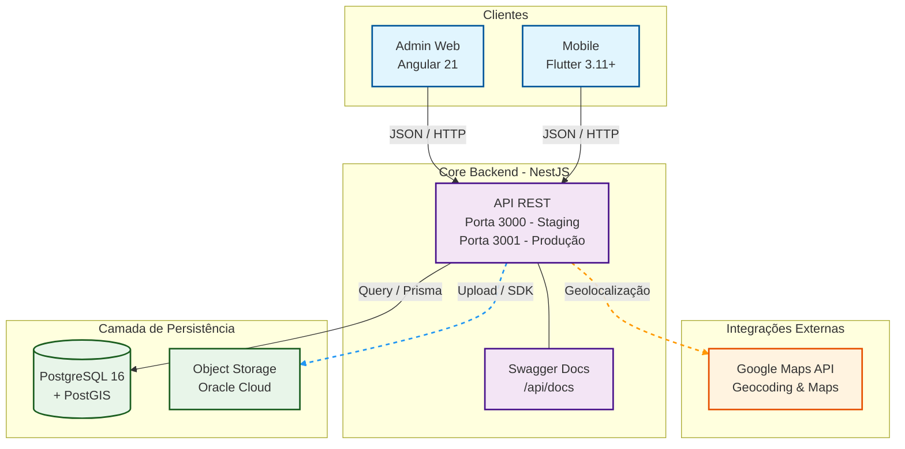
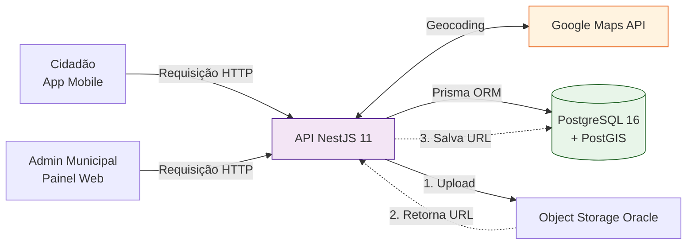

# Arquitetura do Conecta Paraná

## Visão geral

O Conecta Paraná é um monorepo com três frentes que se comunicam através de uma API REST centralizada.


```mermaid
graph TD
    %% Definição de Estilos
    classDef infra fill:#f9f,stroke:#333,stroke-width:2px;
    classDef client fill:#e1f5fe,stroke:#01579b,stroke-width:2px;
    classDef server fill:#f3e5f5,stroke:#4a148c,stroke-width:2px;
    classDef database fill:#e8f5e9,stroke:#1b5e20,stroke-width:2px;
    classDef external fill:#fff3e0,stroke:#e65100,stroke-width:2px;

    subgraph Clientes [Clientes]
        MOBILE[Mobile<br/>Flutter 3.11+]:::client
        ADMIN[Admin Web<br/>Angular 21]:::client
    end

    subgraph External [Integrações Externas]
        GMAPS[Google Maps API<br/>Geocoding & Maps]:::external
    end

    subgraph Backend [Core Backend - NestJS]
        API[API REST<br/>Porta 3000 - Staging<br/>Porta 3001 - Produção]:::server
        SWAGGER[Swagger Docs<br/>/api/docs]:::server
    end

    subgraph Dados [Camada de Persistência]
        DB[(PostgreSQL 16<br/>+ PostGIS)]:::database
        OBJ[Object Storage<br/>Oracle Cloud]:::database
    end

    %% Fluxos de Comunicação
    MOBILE -- "JSON / HTTP" --> API
    ADMIN -- "JSON / HTTP" --> API
    
    API -- "Query / Prisma" --> DB
    API -. "Upload / SDK" .-> OBJ
    API -- "Geolocalização" --> GMAPS
    
    API --- SWAGGER

    %% Notas de implementação
    linkStyle 4 stroke:#ff9800,stroke-width:2px,stroke-dasharray: 5 5;
    linkStyle 3 stroke:#2196f3,stroke-width:2px,stroke-dasharray: 5 5;
```

## Stack por frente

| Frente | Tecnologias principais |
|---|---|
| **Backend** | NestJS 11, TypeScript, Prisma 7 (PrismaPg adapter), PostGIS, Swagger, Jest, Stryker |
| **Admin** | Angular 21 (standalone components), TypeScript, Tailwind CSS, Vite, Jasmine + Karma, Playwright, Stryker |
| **Mobile** | Flutter 3.11+, Dart, Dio |
| **Infra** | Docker, Docker Compose, PostgreSQL 16 + PostGIS, GHCR, GitHub Actions |

## Fluxo de dados


```mermaid
flowchart LR
    %% Clientes
    A[Cidadão<br/>App Mobile] -->|Requisição HTTP| B
    C[Admin Municipal<br/>Painel Web] -->|Requisição HTTP| B

    %% Backend com Portas
    B[API NestJS 11]

    %% Processamento Geográfico
    B <-->|Geocoding| G[Google Maps API]

    %% Persistência e Upload
    B -->|Prisma ORM| D[(PostgreSQL 16<br/>+ PostGIS)]
    B -->|1. Upload| E[Object Storage Oracle]
    E -.->|2. Retorna URL| B
    B -.->|3. Salva URL| D

    %% Estilos
    style B fill:#f3e5f5,stroke:#4a148c
    style D fill:#e8f5e9,stroke:#1b5e20
    style G fill:#fff3e0,stroke:#e65100
```

## Padrão de Identificadores (ULIDs)

Todas as chaves primárias do sistema utilizam ULIDs (Universally Unique Lexicographically Sortable Identifier) prefixados no formato `prefix_01HZX...`. Esta estrutura garante identificadores globais, únicos, ordenáveis e type-safe na manipulação de chaves entre front-end e back-end.

A tabela abaixo define a Fonte de Verdade para o mapeamento Entidade -> Prefixo:

| Model / Entidade | Prefixo ULID | Exemplo |
|---|---|---|
| User | `usr_` | `usr_01H...` |
| City | `cit_` | `cit_01H...` |
| Event | `evt_` | `evt_01H...` |
| Post | `pst_` | `pst_01H...` |
| News | `nws_` | `nws_01H...` |
| Local | `loc_` | `loc_01H...` |
| Category | `cat_` | `cat_01H...` |
| HealthCheck | `hlt_` | `hlt_01H...` |
| Suggestion | `sgt_` | `sgt_01H...` |
| Notification | `nfy_` | `nfy_01H...` |
| Like | `lke_` | `lke_01H...` |
| Favorite | `fav_` | `fav_01H...` |
| Photo | `pho_` | `pho_01H...` |
| RefreshToken | `rfk_` | `rfk_01H...` |

## Ambientes

| Ambiente | Compose file | Descrição |
|---|---|---|
| **Local** | `docker-compose.yml` | Desenvolvimento com hot reload. Backend na porta 3000, admin na 4200, banco na 5432. |
| **Staging** | `docker-compose.staging.yml` | Imagens pré-construídas do GHCR com tag `:staging`. Deploy manual via GitHub Actions. |
| **Produção** | `docker-compose.production.yml` | Imagens do GHCR com tag `:latest`. Deploy automático ao mergear PR na `main`. |

## Deploy

- **Registry:** GitHub Container Registry (GHCR)
- **Plataforma:** Linux/arm64 (build via QEMU + Buildx)
- **Servidor:** VM acessada via SSH

## Mapeamento HTTP → comportamento UI (web-admin)

O `error.interceptor.ts` normaliza todos os erros HTTP em um objeto `AppError { status, message, details }` e decide se dispara um Toast ou repassa silenciosamente ao componente.

### Resolução de mensagem (ordem de prioridade)

1. `error.error?.code` → `ERROR_CODE_MAP`
2. `error.status` → `STATUS_MAP`
3. Fallback genérico

### Tabela de comportamento por status

| Status | Toast PT-BR | Repassado ao componente |
|---|---|---|
| 401 (chamada autenticada) | "Sessão expirada, faça login novamente." (apenas se refresh falhar) | Não — refresh automático transparente |
| 400 | Nenhum | Sim — `AppError` com `details` para destacar campos no form |
| 403 | "Acesso negado." | Sim — `AppError` |
| 404 | Nenhum | Sim — `AppError` com `details` para exibir "não encontrado" |
| 429 | Mensagem vinda do backend (`error.error.message`) | Sim — `AppError` |
| 5xx | "Erro do servidor. Tente novamente em instantes." | Sim — `AppError` |
| 0 / rede | "Sem conexão com o servidor." + botão "Tentar novamente" | Sim — `AppError` |

Codes planejados:

| Code | Status HTTP | Mensagem PT-BR |
|---|---|---|
| `unauthenticated` | 401 | "Sessão expirada, faça login novamente." |
| `role_denied` | 403 | "Acesso negado para este papel." |
| `city_scope_denied` | 403 | "Você só pode atuar na sua cidade." |
| `validation_failed` | 400 | Passthrough sem toast |
| `too_many_attempts` | 429 | Mensagem vinda do backend |

---

## Mapeamento HTTP → comportamento UI (mobile)

O `ApiClient` (Dio) centraliza todas as requisições HTTP do app mobile. Três interceptors registrados em ordem tratam autenticação, refresh de token e erros:

- `AuthInterceptor` — injeta `Authorization: Bearer <token>` em requisições marcadas com `extra: {'auth': true}`
- `RefreshInterceptor` — intercepta 401, tenta renovar o token via `POST /auth/refresh` e refaz a requisição original de forma transparente; serializa requisições paralelas para evitar múltiplos refreshes simultâneos
- `ErrorInterceptor` — mapeia códigos HTTP para mensagens PT-BR via `ScaffoldMessenger`

### Fluxo de auto-refresh

```
requisição autenticada → backend 401
  → RefreshInterceptor segura a requisição
  → POST /auth/refresh
    → ok: salva novos tokens, refaz requisição original → usuário não percebe nada
    → 401: AuthService.logout(expired: true) → AuthGate redireciona para /login
                                              → SnackBar "Sessão expirada."
```

Requisições paralelas que chegam durante um refresh em andamento entram em fila (`List<Completer>`) e são liberadas quando o refresh termina — o mesmo padrão de CPR-305 do web-admin.

### Tabela de comportamento por status (mobile)

| Status / Cenário | SnackBar PT-BR | Repassado ao componente |
|---|---|---|
| 401 em chamada autenticada | Nenhum — refresh automático transparente | Não |
| 401 após refresh falhar | "Sessão expirada." + redireciona para /login | Não |
| 400 `validation_failed` | Nenhum | Sim — componente destaca campos inválidos |
| 404 em GET | Nenhum | Sim — tela exibe estado "não encontrado" com botão Voltar |
| 403 | "Você não tem permissão para esta ação." | Não |
| 429 | Mensagem vinda do backend | Não |
| 5xx | "Erro do servidor. Tente novamente em instantes." | Não |
| Falha de rede / timeout > 15s | "Sem conexão com o servidor." | Não |
| Outros | "Erro inesperado. Tente novamente." | Não |

### Observações

- `validation_failed` nunca vira SnackBar — é repassado ao componente para destacar campos do formulário
- `403 city_scope_denied` praticamente não ocorre no mobile (cidadão só lê e cria conteúdo próprio); se ocorrer, SnackBar genérico
- Timeout global de 15s configurado em `connectTimeout`, `receiveTimeout` e `sendTimeout`
- Base URL configurada por flavor via `--dart-define=API_BASE_URL=...` em tempo de compilação

---

## Estrutura do monorepo

```
conecta-parana/
├── backend/             # API NestJS + Prisma
├── admin/               # Painel web Angular
├── mobile/              # App Flutter
├── infra/               # Dockerfile do banco (PostGIS)
├── docs/                # Documentação do projeto
├── .github/workflows             # CI/CD pipelines
├── docker-compose.yml            # Local
├── docker-compose.staging.yml    # Staging
└── docker-compose.production.yml # Produção
```
