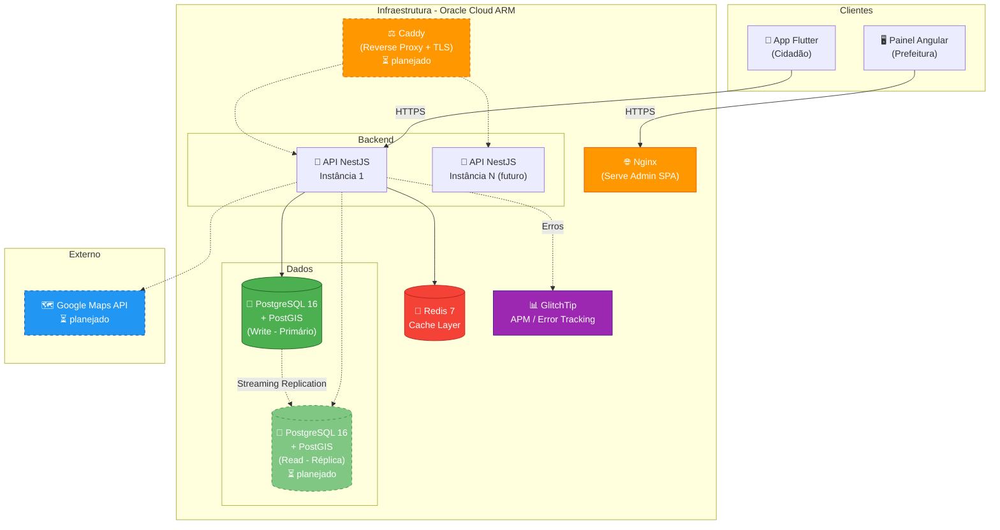

# System Design - Conecta Paraná

Documento técnico de arquitetura, capacity planning, escalabilidade, concorrência, cache e monitoramento do sistema Conecta Paraná.

Fonte dos dados demográficos: IBGE - Estimativas da População 2025.

---

## 1. Visão Geral da Arquitetura



### Componentes

| Componente | Tecnologia | Função | Status |
|-----------|-----------|--------|--------|
| Servidor web (admin) | Nginx | Serve SPA Angular, cache de assets estáticos | Atual |
| Reverse proxy + TLS | Caddy | TLS automático via Let's Encrypt, roteamento de domínios, load balancing | Planejado |
| API | NestJS 11 + TypeScript | Lógica de negócio, autenticação, validação | Atual |
| Cache | Redis 7 | Cache de leituras frequentes (locais, categorias) | Atual |
| Banco (write) | PostgreSQL 16 + PostGIS | Persistência, queries geoespaciais | Atual |
| Banco (read) | Réplica PostgreSQL | Leituras pesadas separadas do primário | Planejado |
| APM | GlitchTip (self-hosted) | Error tracking, monitoramento de exceções | Atual |
| Google Maps API | Externo | Geocoding, dados de locais públicos | Planejado |

---

## 2. Capacity Planning

### 2.1. Premissas Demográficas (IBGE 2025)

| Dado | Valor | Fonte |
|------|-------|-------|
| População do Paraná | 11.890.517 | IBGE Estimativa 2025 |
| Municípios no Paraná | 399 | IBGE |
| Paiçandu (cidade inicial) | 48.695 | IBGE Estimativa 2025 |
| Maringá (expansão fase 2) | 429.660 | IBGE Estimativa 2025 |
| Região Metropolitana de Maringá | 896.763 | IBGE Estimativa 2025 |

### 2.2. Cenários de Adoção

Baseado em análise de tráfego de sites de prefeituras via SemRush: cidades como Maringá e Curitiba têm ~20% de visitantes únicos/mês em canais digitais. Cidades menores como Paiçandu ficam em 5-10%, porém com canais de baixa qualidade - um app dedicado e bem feito tende a elevar essa adoção.

| Cenário | Taxa de adoção | Paiçandu | Maringá | Paraná inteiro |
|---------|---------------|----------|---------|----------------|
| Conservador (5%) | 5% da população | 2.435 | 21.483 | 594.526 |
| Moderado (15%) | 15% da população | 7.304 | 64.449 | 1.783.577 |
| Otimista (20%) | 20% da população | 9.739 | 85.932 | 2.378.103 |

### 2.3. Usuários Simultâneos (Pior Cenário)

A taxa de concorrência típica em apps municipais é de 5-10% dos usuários cadastrados online ao mesmo tempo, com picos em horários de almoço (11h-13h) e início da noite (18h-20h).

| Cenário | Cadastrados | Simultâneos (10%) | Pior cenário (pico 15%) |
|---------|-------------|-------------------|------------------------|
| **Paiçandu (lançamento)** | 7.304 | 730 | **1.096** |
| **Maringá (fase 2)** | 64.449 | 6.445 | **9.667** |
| **Paraná inteiro (futuro)** | 1.783.577 | 178.358 | **267.537** |

### 2.4. Peso das Tabelas no Banco

Cálculo de bytes por linha para as 3 tabelas principais, com base nos tipos PostgreSQL.

#### Tabela: User

| Campo | Tipo PostgreSQL | Bytes |
|-------|----------------|-------|
| id | INTEGER (serial) | 4 |
| name | VARCHAR(100) | ~30 (média) |
| email | VARCHAR(255) | ~25 (média) |
| password | VARCHAR(60) - bcrypt | 60 |
| is_active | BOOLEAN | 1 |
| role | ENUM (interno: 4 bytes) | 4 |
| city_id | INTEGER (nullable, FK) | 4 |
| created_at | TIMESTAMP | 8 |
| updated_at | TIMESTAMP | 8 |
| **Overhead PostgreSQL** (header de tupla, alignment) | | ~23 |
| **Total por linha** | | **~167 bytes** |

Projeção de armazenamento para User:

| Cenário | Usuários | Armazenamento |
|---------|----------|---------------|
| Paiçandu | 7.304 | ~1,2 MB |
| Maringá | 64.449 | ~10,3 MB |
| Paraná inteiro | 1.783.577 | ~284 MB |

#### Tabela: Post (Postagem da prefeitura)

| Campo | Tipo PostgreSQL | Bytes |
|-------|----------------|-------|
| id | INTEGER | 4 |
| title | VARCHAR(200) | ~50 (média) |
| description | TEXT | ~500 (média) |
| type | VARCHAR(30) | ~15 (média) |
| is_active | BOOLEAN | 1 |
| city_id | INTEGER (FK) | 4 |
| user_id | INTEGER (FK) | 4 |
| created_at | TIMESTAMP | 8 |
| updated_at | TIMESTAMP | 8 |
| **Overhead** | | ~23 |
| **Total por linha** | | **~617 bytes** |

Projeção: estimando ~20 posts/mês por cidade ativa.

| Cenário | Cidades ativas | Posts/ano | Armazenamento/ano |
|---------|---------------|-----------|-------------------|
| Paiçandu (1 cidade) | 1 | 240 | ~145 KB |
| 10 cidades | 10 | 2.400 | ~1,4 MB |
| 100 cidades | 100 | 24.000 | ~14 MB |
| 399 cidades (PR inteiro) | 399 | 95.760 | ~56 MB |

#### Tabela: Local (Ponto de interesse)

| Campo | Tipo PostgreSQL | Bytes |
|-------|----------------|-------|
| id | INTEGER | 4 |
| name | VARCHAR(200) | ~40 (média) |
| description | TEXT (nullable) | ~200 (média) |
| phone | VARCHAR(20) (nullable) | ~14 (média) |
| coordinates | geometry(Point, 4326) | 32 |
| is_active | BOOLEAN | 1 |
| city_id | INTEGER (FK) | 4 |
| category_id | INTEGER (FK) | 4 |
| created_by_id | INTEGER (FK) | 4 |
| created_at | TIMESTAMP | 8 |
| updated_at | TIMESTAMP | 8 |
| **Overhead** | | ~23 |
| **Total por linha** | | **~342 bytes** |

Projeção: ~50 locais por cidade pequena, ~500 por cidade grande.

| Cenário | Locais totais | Armazenamento |
|---------|--------------|---------------|
| Paiçandu | 50 | ~17 KB |
| 10 cidades | 1.500 | ~501 KB |
| 100 cidades | 25.000 | ~8,2 MB |
| 399 cidades (PR inteiro) | 80.000 | ~26 MB |

### 2.5. Cálculo de KB por Request

| Endpoint | Método | Payload médio (JSON) | Frequência (pico) |
|----------|--------|---------------------|-------------------|
| GET /health | GET | 0,1 KB | Monitoramento |
| GET /posts?city_id=X | GET | ~5 KB (lista 20 posts) | Alta |
| GET /events?city_id=X | GET | ~8 KB (lista com coords) | Alta |
| GET /news?city_id=X | GET | ~4 KB | Média |
| POST /auth/login | POST | 0,3 KB req / 0,5 KB resp | Média |
| POST /suggestions | POST | 0,8 KB | Baixa |
| POST /likes | POST | 0,1 KB | Alta |

### 2.6. MB/GB por Minuto (Pior Cenário)

**Premissas do pior cenário:**
- Cenário moderado (15% adoção) em Maringá: 9.667 usuários simultâneos
- Cada usuário faz ~1 request a cada 10 segundos (navegando ativamente pelo app)
- Payload médio ponderado: ~5 KB por request

| Métrica | Cálculo | Resultado |
|---------|---------|-----------|
| Requests por segundo | 9.667 ÷ 10 | **~967 req/s** |
| KB por segundo | 967 × 5 KB | **~4.835 KB/s** |
| **MB por minuto** | 4.835 × 60 ÷ 1024 | **~283 MB/min** |
| GB por hora | 283 × 60 ÷ 1024 | **~16,6 GB/h** |

**Para o Paraná inteiro (futuro, pior cenário otimista):**

| Métrica | Cálculo | Resultado |
|---------|---------|-----------|
| Usuários simultâneos | 267.537 | |
| Requests por segundo | 267.537 ÷ 10 | **~26.754 req/s** |
| MB por minuto | 26.754 × 5 × 60 ÷ 1024 | **~7.841 MB/min (~7,7 GB/min)** |
| GB por hora | 7.841 × 60 ÷ 1024 | **~459.4 GB/h** |

Este cenário extremo exigiria múltiplas instâncias do backend com load balancer, réplicas de leitura do banco, e cache agressivo.

### 2.7. Armazenamento Total Estimado (após 2 anos de operação com 100 cidades)

| Tabela | Registros | Armazenamento |
|--------|-----------|---------------|
| User | 500.000 | ~80 MB |
| Post | 48.000 | ~28 MB |
| Event | 24.000 | ~18 MB |
| News | 12.000 | ~8 MB |
| Local | 25.000 | ~8 MB |
| Photo | 75.000 | ~15 MB (metadados; arquivos no Object Storage — planejado) |
| Like | 2.000.000 | ~80 MB |
| Favorite | 500.000 | ~20 MB |
| Suggestion | 50.000 | ~30 MB |
| Notification | 100.000 | ~50 MB |
| Notification_Dismiss | 1.000.000 | ~32 MB |
| Índices + overhead | - | ~100 MB |
| **Total banco** | | **~469 MB** |
| **Fotos (Object Storage — planejado)** | 75.000 × 500KB média | **~35 GB** |

**Conclusão:** O banco de dados cabe confortavelmente em uma VM com 24GB RAM. O gargalo de armazenamento são as fotos, que devem ir para Object Storage (Oracle Cloud Object Storage — planejado).

### 2.8. Justificativa da Escolha de Banco e Cloud

| Decisão | Escolha | Justificativa |
|---------|---------|---------------|
| Banco de dados | PostgreSQL 16 | Open-source, maduro, suporte nativo a JSON, excelente performance em reads/writes, extensível |
| Extensão geoespacial | PostGIS | Padrão da indústria para queries de proximidade (ST_DWithin, ST_Distance). Essencial para "locais perto de mim" |
| Cloud | Oracle Cloud Always Free | 4 cores ARM, 24GB RAM, 200GB boot volume - totalmente gratuito. Performance de ARM Ampere superior a instâncias equivalentes x86 |
| Cache | Redis 7 | In-memory, latência sub-milissegundo, ideal para cache de leituras frequentes |

---

## 3. Escalabilidade

### 3.1. Fase Atual: Escalabilidade Vertical

A VM Oracle Always Free ARM oferece 4 cores e 24GB RAM. Para o cenário de Paiçandu e Maringá (~10K usuários simultâneos), escalabilidade vertical é suficiente.

| Recurso | Disponível | Necessário (Maringá pico) | Utilização |
|---------|-----------|--------------------------|------------|
| CPU | 4 cores ARM | ~2 cores (NestJS single-thread + workers) | 50% |
| RAM | 24 GB | ~4 GB (Node.js) + ~2 GB (PostgreSQL) + ~1 GB (Redis) | ~29% |
| Disco | 200 GB | ~1 GB (banco) + ~35 GB (fotos em 2 anos) | ~18% |
| Rede | 50 Mbps | ~38 Mbps (283 MB/min ÷ 60 × 8) | 76% |

**Conclusão:** A infraestrutura atual suporta até ~10K usuários simultâneos sem necessidade de escalar.

### 3.2. Fase Futura: Escalabilidade Horizontal

Quando o sistema expandir para o Paraná inteiro (267K usuários simultâneos no pior cenário), será necessário escalar horizontalmente:

| Componente | Estratégia |
|-----------|-----------|
| Backend (API) | Múltiplas instâncias NestJS atrás de um load balancer. O app é stateless (JWT no header, sem session no servidor), então qualquer instância pode atender qualquer request. |
| Banco (read) | Réplica de leitura via PostgreSQL Streaming Replication. Reads pesados (listagem de locais, feed de posts) vão para a réplica. Writes continuam no primário. |
| Banco (write) | Escala vertical primeiro (mais CPU/RAM). Se necessário, sharding por cidade. |
| Cache (Redis) | Redis Cluster para distribuir chaves entre nós. |
| Fotos | Object Storage Oracle — planejado (escalável por natureza, sem limite prático). |

### 3.3. Quando escalar?

| Indicador | Threshold | Ação |
|-----------|-----------|------|
| CPU > 70% sustentado por 5 min | Alerta | Adicionar instância do backend |
| Latência P95 > 500ms | Alerta | Verificar queries lentas, adicionar cache |
| Conexões PostgreSQL > 80% do pool | Alerta | Adicionar réplica de leitura |
| RAM Redis > 80% | Alerta | Aumentar instância ou Redis Cluster |
| Armazenamento DB > 75% | Alerta | Expandir volume de armazenamento do RDS/PostgreSQL |

---

## 4. Concorrência: Lock Otimista

O lock otimista é uma estratégia de controle de concorrência onde o registro não é travado durante a leitura. Na escrita, o sistema verifica se o dado foi alterado por outro processo desde a leitura original (usando um campo de versão ou timestamp). Se houve alteração, a operação falha e pode ser retentada. Isso evita travas no banco, mantendo alto throughput e boa escalabilidade.

**Por que lock otimista no Conecta Paraná:**
- O Conecta Paraná é um app de consulta e conteúdo, não um sistema financeiro
- A probabilidade de dois admins editarem o mesmo post simultaneamente é muito baixa
- Operações de escrita são predominantemente de criação (novos posts, eventos, locais), não de atualização concorrente
- Lock otimista permite maior throughput (vazão) e melhor escalabilidade horizontal

**Implementação no Prisma:**
- Campo `updated_at` com `@updatedAt` em todas as entidades editáveis
- Transações com `prisma.$transaction()` para operações que afetam múltiplas tabelas (ex: criar evento + fotos)
- Para o cenário raro de edição concorrente: verificar `updated_at` antes de salvar. Se mudou, retornar HTTP 409 Conflict

```typescript
// Exemplo de lock otimista no update
const post = await prisma.post.update({
  where: {
    id: postId,
    updatedAt: originalUpdatedAt, // verifica se ninguém alterou
  },
  data: { title: newTitle },
});
// Se updatedAt mudou, o where não encontra → lança erro
```

---

## 5. Arquitetura Detalhada

### 5.1. Servidor Web e Reverse Proxy

**Fase atual:** Sem reverse proxy dedicado. O admin Angular é servido por **Nginx** dentro do container Docker (SPA com `try_files`, cache de 1 ano para assets). O backend NestJS expõe porta diretamente via Docker (staging: `3000`, produção: `3001`). CORS configurado para aceitar requests do admin e do app mobile.

```
App Mobile ──→ HTTPS ──→ backend:3001 (porta Docker exposta)
Painel Admin ──→ HTTPS ──→ nginx:4201 (container Nginx serve SPA)
```

**Fase planejada (ao escalar):** Caddy como reverse proxy no host para TLS automático via Let's Encrypt e roteamento por domínio:

```
api.conectaparana.com.br   → Caddy → backend:3000 (instância 1)
                                   → backend:3002 (instância N)
admin.conectaparana.com.br → Caddy → admin:80
```

Algoritmo de balanceamento: round-robin ou least-connections.

### 5.2. Banco de Dados: Leitura e Escrita

**Fase atual:** Um único PostgreSQL (read + write no mesmo servidor).

**Fase futura (quando necessário):**

```
                    ┌──→ PostgreSQL Réplica (READ)
                    │    - GET /posts
                    │    - GET /locals?lat&lng
                    │    - GET /events
                    │
Backend API ────────┤
                    │
                    └──→ PostgreSQL Primário (WRITE)
                         - POST /posts
                         - POST /events
                         - PUT /suggestions/:id
```

Configuração via PostgreSQL Streaming Replication. No Prisma, usar datasource separado para reads ou middleware que roteia queries SELECT para a réplica.

**Quando ativar:** Quando o banco primário mostrar latência > 100ms em queries de leitura durante picos, ou conexões acima de 80% do pool.

### 5.3. Camada de Cache (Redis)

Redis está configurado como cache layer global no NestJS via `@nestjs/cache-manager` com `@keyv/redis`.

**O que cachear:**

| Dado | TTL | Justificativa |
|------|-----|---------------|
| Lista de categorias | 1 hora | Muda raramente (admin cria categoria nova ocasionalmente) |
| Locais por cidade | 5 minutos | Muda pouco, consultado frequentemente (mapa) |
| Feed de posts por cidade | 2 minutos | Muda com frequência moderada |
| Contagem de likes | 30 segundos | Muda frequentemente, tolerável ter 30s de delay |
| Health check | 30 segundos | Prova de conceito já implementada |

**O que NÃO cachear:**

| Dado | Motivo |
|------|--------|
| Dados do usuário (/auth/me) | Personalizado por usuário, não faz sentido cachear |
| Resultado de busca geoespacial | Depende de lat/lng exatos, cache hit rate seria muito baixo |
| Operações de escrita | Cache é para leituras |

**Estratégia de invalidação:**
- **TTL-based:** Cada chave tem TTL definido. Expirou, busca no banco de novo.
- **Write-through:** Quando admin cria/edita post, invalidar cache do feed daquela cidade (`cache.del('posts:city:${cityId}')`).

**Implementação atual:**
```typescript
// Endpoint com cache automático via interceptor
@Get('health')
@UseInterceptors(CacheInterceptor)
@CacheTTL(30_000)
getHealth() { ... }

// Cache manual para lógica mais complexa (futuro)
const cached = await this.cacheManager.get(`locals:city:${cityId}`);
if (cached) return cached;
const locals = await this.prisma.local.findMany({ where: { cityId } });
await this.cacheManager.set(`locals:city:${cityId}`, locals, 300_000);
return locals;
```

---

## 6. Monitoramento e Logs

### 6.1. Regra Fundamental: Logs NÃO vão para o banco de dados

Salvar logs no banco de dados é um anti-pattern:
- Gera volume massivo de writes no banco (cada request = 1+ insert de log)
- Degrada performance do banco de produção
- Mistura dados de observabilidade com dados de negócio
- Torna o banco o single point of failure para diagnóstico

### 6.2. Estratégia de Logging

**Atual:**

```
Backend NestJS
    │
    ├── NestJS Logger (stdout)
    │       │
    │       └── Docker captura → docker logs
    │
    └── @sentry/node SDK (SentryExceptionFilter)
            │
            └── GlitchTip (erros 5xx e exceções não-tratadas)
```

- NestJS built-in `Logger` escreve no stdout, capturado pelo Docker (`docker logs`)
- `SentryExceptionFilter` intercepta exceções não-tratadas e reporta via `Sentry.captureException()` para o GlitchTip
- Erros 4xx (erros esperados) não são reportados ao GlitchTip

**Planejado — Pino como logger estruturado:**

```
Backend NestJS
    │
    ├── Pino (stdout — JSON estruturado)
    │       │
    │       ├── Dev: pino-pretty (formato legível)
    │       └── Prod: JSON puro → Docker captura → docker logs
    │
    └── @sentry/node SDK (SentryExceptionFilter)
            │
            └── GlitchTip (erros 5xx e exceções não-tratadas)
```

- JSON estruturado em produção para facilitar parsing e busca
- Request ID automático em cada log para correlação entre requests
- Nível: `info` para requests, `warn` para situações anômalas, `error` para falhas

**Error tracking (GlitchTip):**
- Self-hosted na mesma VM (compose separado)
- Compatível com SDK do Sentry (`@sentry/node`)
- Só reporta erros 5xx e exceções não-tratadas (4xx são erros esperados)
- Dashboard acessível via browser para visualizar erros agrupados
- Sem limite de eventos (self-hosted)

### 6.3. O que Monitorar

| Métrica | Onde | Alerta quando |
|---------|------|---------------|
| Error rate (5xx) | GlitchTip | > 1% das requests |
| Response time P95 | Logs / futuro: métricas | > 500ms |
| CPU/RAM do container | `docker stats` | > 70% sustentado |
| Conexões PostgreSQL | pg_stat_activity | > 80% do pool |
| Redis memory usage | `redis-cli info memory` | > 80% do maxmemory |
| Disk usage | `df -h` | > 70% |
| Container restarts | `docker events` | Qualquer restart inesperado |

### 6.4. Comandos de Monitoramento

```bash
# Logs do backend (produção)
docker compose logs backend --tail 100 -f

# Erros no GlitchTip
# Acessar http://<IP>:8080

# Status dos containers
docker compose ps

# Uso de recursos
docker stats

# Conexões do PostgreSQL
docker compose exec db psql -U $DB_USER -d $DB_NAME -c "SELECT count(*) FROM pg_stat_activity;"

# Redis info
docker compose exec redis redis-cli info memory
```

---

## Referências

- IBGE - Estimativas da População 2025: https://www.ibge.gov.br/estatisticas/sociais/populacao
- IBGE Cidades - Paiçandu/PR: https://www.ibge.gov.br/cidades-e-estados/pr/paicandu.html
- IBGE Cidades - Paraná: https://www.ibge.gov.br/cidades-e-estados/pr.html
- PostgreSQL Documentation: https://www.postgresql.org/docs/16/
- PostGIS Documentation: https://postgis.net/documentation/
- NestJS Caching: https://docs.nestjs.com/techniques/caching
- GlitchTip Documentation: https://glitchtip.com/documentation
- Oracle Cloud Always Free: https://www.oracle.com/cloud/free/
