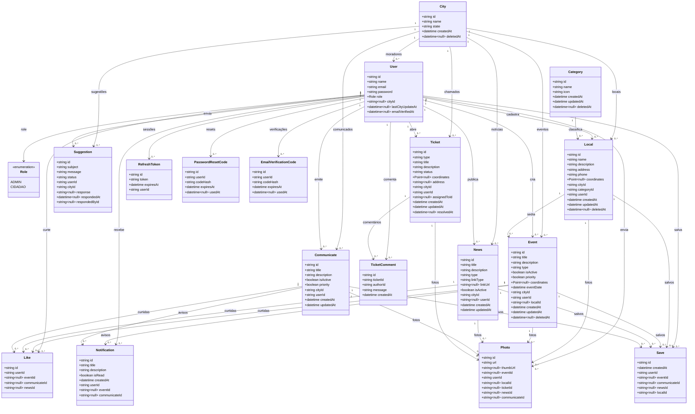

# Diagrama de Classe - Conecta Parana

Modelo de domínio derivado de `backend/prisma/schema.prisma`. Cada classe corresponde a um model do Prisma (nome da tabela entre parênteses). Atributos técnicos de índice (GIN/Gist, geometry bruto) foram omitidos para manter o foco no domínio. As entidades de infra de autenticação aparecem de forma simplificada.

## Notas de leitura

- **Save** é a entidade antes chamada "Favorite" (tabela `saves`, prefixo `sav_`). Representa conteúdo salvo pelo cidadão e pode apontar para evento, comunicado, notícia ou local.
- **Like** e **Save** são polimórficos por convenção: cada registro referencia no máximo um tipo de conteúdo via FKs opcionais, com unicidade por (usuário, conteúdo).
- **Photo** também é poliassociada: pertence a um único dono (evento, local, chamado, notícia ou comunicado) e sempre a um usuário que enviou.
- **Ticket** modela chamados de serviço, com atribuição opcional a um admin (`assignedToId`) e histórico em **TicketComment**.
- Entidades de auth (`RefreshToken`, `PasswordResetCode`, `EmailVerificationCode`) sustentam sessão e fluxos de senha/verificação; aparecem simplificadas por não fazerem parte do domínio de negócio.
- `HealthCheck` foi omitida por ser tabela de diagnóstico de infra.
