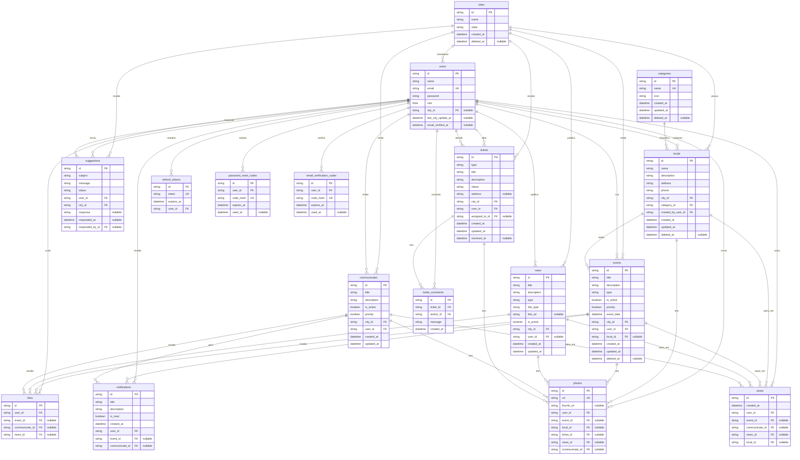

# Diagrama Entidade-Relacionamento - Conecta Parana

Modelo físico derivado de `backend/prisma/schema.prisma`. Os nomes seguem as tabelas reais do banco (snake_case). Colunas de índice espacial/textual e o tipo bruto `geometry` foram omitidos; apenas chaves e colunas relevantes ao relacionamento aparecem.

## Notas de leitura

- **PK** = chave primária (ULID prefixado), **FK** = chave estrangeira, **UK** = chave única. `nullable` marca coluna opcional.
- **`users` aparece duas vezes** ligada a `suggestions` (autor `user_id` e respondente `responded_by_id`) e a `tickets` (autor `user_id` e responsável `assigned_to_id`).
- **`likes` e `saves`** carregam FKs opcionais mútuas para os diferentes conteúdos; a unicidade real é por (usuário, conteúdo) e garante um voto/salvo por item. `saves` também alcança `locals`, o que `likes` não faz.
- **`photos`** referencia um único dono entre evento, local, chamado, notícia ou comunicado, sempre com o `user_id` de quem enviou.
- Colunas `geometry(Point, 4326)` (em `events`, `locals`, `tickets`) e os índices GIN/Gist do PostGIS/`pg_trgm` foram omitidos por serem detalhe de infra, não de modelagem relacional.
