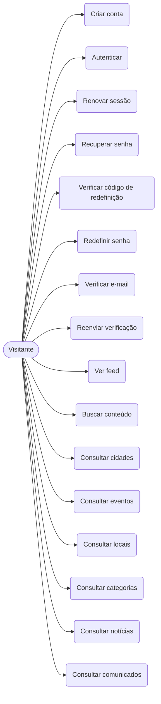
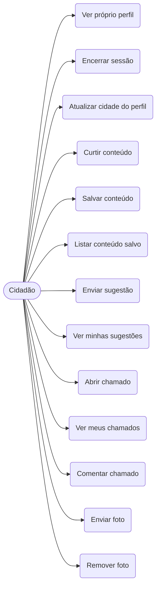
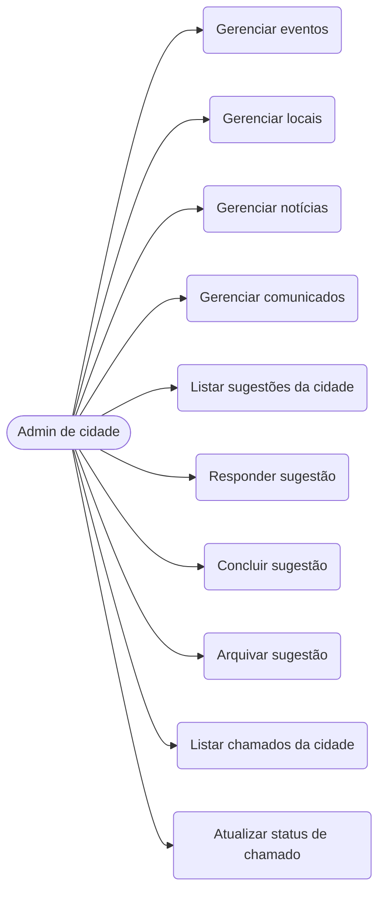
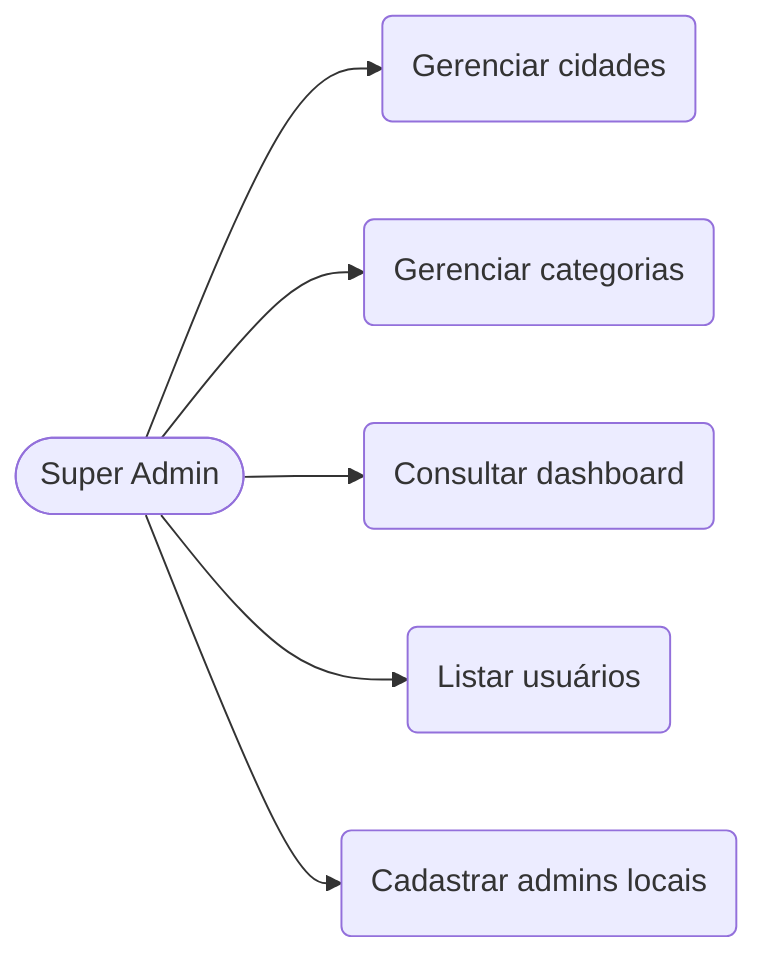

# Casos de Uso - Conecta Parana

Casos de uso derivados do estado real do backend (`backend/src/modules/*/*.controller.ts`), classificados pelo controle de acesso real de cada rota (`@Public`, `@Roles`, `@AdminRoute`, `SuperAdminGuard`). Rotas de infra/diagnóstico (`/health`, `/admin/test`) foram omitidas.

## Atores

| Ator | Definição | Controle de acesso |
|---|---|---|
| **Visitante** | Usuário não autenticado (app ou web). | `@Public()` |
| **Cidadão** | Usuário autenticado com papel `CIDADAO`, vinculado a uma cidade. | `@Roles(CIDADAO)` ou rota apenas autenticada |
| **Admin de cidade** | Usuário `ADMIN` com `cityId` definido; atua no escopo da própria cidade. | `@AdminRoute()` / `@Roles(ADMIN)` + `@RequireCityScope()` |
| **Super Admin** | Usuário `ADMIN` com `cityId` nulo; gerencia dados globais. | `SuperAdminGuard` |

A herança de atores é cumulativa: Cidadão também executa os casos de Visitante; Admin de cidade também executa os de Cidadão; Super Admin acessa as rotas globais protegidas por `SuperAdminGuard`.

## Visão geral - Visitante

## Visão geral - Cidadão

## Visão geral - Admin de cidade

## Visão geral - Super Admin

## Detalhamento dos casos de uso

Legenda de rotas: método HTTP + caminho real do controller.

### Visitante

| ID | Caso de uso | Rota | Pré-condição | Fluxo principal | Pós-condição |
|---|---|---|---|---|---|
| UC-01 | Criar conta | `POST /auth/register` | E-mail ainda não cadastrado. | Informar nome, e-mail e senha; sistema valida e cria o usuário como `CIDADAO`. | Conta criada; e-mail de verificação disparado. |
| UC-02 | Autenticar | `POST /auth/login` | Conta existente. | Informar e-mail e senha; sistema valida credenciais. | Tokens de acesso e refresh emitidos. |
| UC-03 | Renovar sessão | `POST /auth/refresh` | Refresh token válido. | Enviar refresh token; sistema rotaciona o par de tokens. | Novo par de tokens emitido. |
| UC-04 | Recuperar senha | `POST /auth/forgot-password` | Conta existente. | Informar e-mail; sistema gera código de redefinição e envia. | Código de redefinição enviado por e-mail. |
| UC-05 | Verificar código de redefinição | `POST /auth/verify-reset-code` | Código gerado e não expirado. | Informar e-mail e código; sistema confere o hash. | Código confirmado como válido. |
| UC-06 | Redefinir senha | `POST /auth/reset-password` | Código válido. | Informar código e nova senha; sistema atualiza a senha. | Senha redefinida; código consumido. |
| UC-07 | Verificar e-mail | `POST /auth/verify-email` | Código de verificação enviado. | Informar código; sistema valida e marca o e-mail. | `email_verified_at` preenchido. |
| UC-08 | Reenviar verificação | `POST /auth/resend-verification` | Conta com e-mail não verificado. | Solicitar reenvio; sistema gera novo código. | Novo código de verificação enviado. |
| UC-09 | Ver feed | `GET /feed` | - | Solicitar feed; sistema retorna conteúdo agregado. | Feed exibido. |
| UC-10 | Buscar conteúdo | `GET /search` | - | Informar termo; sistema busca em conteúdos indexados. | Resultados retornados. |
| UC-11 | Consultar cidades | `GET /cities`, `GET /cities/stats`, `GET /cities/:id` | - | Listar cidades, ver estatísticas ou detalhe de uma cidade. | Dados de cidade exibidos. |
| UC-12 | Consultar eventos | `GET /events`, `GET /events/:id` | - | Listar ou abrir um evento. | Evento exibido. |
| UC-13 | Consultar locais | `GET /locals`, `GET /locals/nearby`, `GET /locals/:id` | - | Listar, buscar por proximidade ou abrir um local. | Local exibido. |
| UC-14 | Consultar categorias | `GET /categories`, `GET /categories/:id` | - | Listar ou abrir categoria. | Categoria exibida. |
| UC-15 | Consultar notícias | `GET /news`, `GET /news/:id` | - | Listar ou abrir notícia. | Notícia exibida. |
| UC-16 | Consultar comunicados | `GET /communicates`, `GET /communicates/:id` | - | Listar ou abrir comunicado. | Comunicado exibido. |

### Cidadão

| ID | Caso de uso | Rota | Pré-condição | Fluxo principal | Pós-condição |
|---|---|---|---|---|---|
| UC-17 | Ver próprio perfil | `GET /auth/me` | Autenticado. | Solicitar dados da sessão atual. | Perfil retornado. |
| UC-18 | Encerrar sessão | `POST /auth/logout`, `POST /auth/logout-all` | Autenticado. | Encerrar a sessão atual ou todas as sessões. | Refresh token(s) invalidado(s). |
| UC-19 | Atualizar cidade do perfil | `PUT /users/me/city` | Autenticado. | Selecionar nova cidade; sistema aplica e registra a data. | `cityId` e `last_city_update_at` atualizados. |
| UC-20 | Curtir conteúdo | `POST /likes/toggle` | Autenticado como `CIDADAO`. | Alternar curtida sobre evento, notícia ou comunicado. | Curtida criada ou removida. |
| UC-21 | Salvar conteúdo | `POST /saves/toggle` | Autenticado como `CIDADAO`. | Alternar salvamento de evento, notícia, comunicado ou local. | Item salvo ou removido dos salvos. |
| UC-22 | Listar conteúdo salvo | `GET /saves/me` | Autenticado como `CIDADAO`. | Solicitar a lista de itens salvos. | Itens salvos retornados. |
| UC-23 | Enviar sugestão | `POST /suggestions` | Autenticado como `CIDADAO`. | Informar assunto e mensagem; sistema cria a sugestão com status `enviada`. | Sugestão registrada para a cidade. |
| UC-24 | Ver minhas sugestões | `GET /suggestions/me` | Autenticado como `CIDADAO`. | Solicitar as próprias sugestões. | Sugestões do cidadão retornadas. |
| UC-25 | Abrir chamado | `POST /tickets` | Autenticado como `CIDADAO`. | Informar tipo, título, descrição e localização; sistema cria o chamado com status `aberto`. | Chamado registrado para a cidade. |
| UC-26 | Ver meus chamados | `GET /tickets/me` | Autenticado como `CIDADAO`. | Solicitar os próprios chamados. | Chamados do cidadão retornados. |
| UC-27 | Comentar chamado | `POST /tickets/:id/comments` | Autenticado; chamado existente. | Adicionar comentário ao chamado. | Comentário registrado no histórico. |
| UC-28 | Enviar foto | `POST /uploads/photos` | Autenticado. | Enviar arquivo de imagem; sistema armazena e gera URL/thumb. | Foto armazenada e associada. |
| UC-29 | Remover foto | `DELETE /uploads/photos/:id` | Autenticado; foto existente. | Solicitar remoção da foto. | Foto removida do armazenamento. |

### Admin de cidade

| ID | Caso de uso | Rota | Pré-condição | Fluxo principal | Pós-condição |
|---|---|---|---|---|---|
| UC-30 | Gerenciar eventos | `POST /events`, `PUT /events/:id`, `DELETE /events/:id` | `ADMIN` no escopo da cidade. | Criar, editar ou excluir evento da própria cidade. | Evento criado/atualizado/removido. |
| UC-31 | Gerenciar locais | `POST /locals`, `PUT /locals/:id`, `DELETE /locals/:id` | `ADMIN` no escopo da cidade. | Criar, editar ou excluir local da própria cidade. | Local criado/atualizado/removido. |
| UC-32 | Gerenciar notícias | `POST /news`, `PATCH /news/:id`, `DELETE /news/:id` | `ADMIN` no escopo da cidade. | Criar, editar ou excluir notícia da própria cidade. | Notícia criada/atualizada/removida. |
| UC-33 | Gerenciar comunicados | `POST /communicates`, `PATCH /communicates/:id`, `DELETE /communicates/:id` | `ADMIN` no escopo da cidade. | Criar, editar ou excluir comunicado da própria cidade. | Comunicado criado/atualizado/removido. |
| UC-34 | Listar sugestões da cidade | `GET /suggestions`, `GET /suggestions/:id` | `ADMIN` no escopo da cidade. | Listar e abrir sugestões dos cidadãos. | Sugestões exibidas. |
| UC-35 | Responder sugestão | `PUT /suggestions/:id/respond` | Sugestão pendente na cidade. | Registrar resposta; sistema grava resposta e respondente. | Sugestão respondida. |
| UC-36 | Concluir sugestão | `PUT /suggestions/:id/conclude` | Sugestão respondida. | Marcar a sugestão como concluída. | Status atualizado para concluída. |
| UC-37 | Arquivar sugestão | `PUT /suggestions/:id/archive` | Sugestão existente na cidade. | Arquivar a sugestão. | Status atualizado para arquivada. |
| UC-38 | Listar chamados da cidade | `GET /tickets`, `GET /tickets/:id` | `ADMIN` no escopo da cidade. | Listar e abrir chamados dos cidadãos. | Chamados exibidos. |
| UC-39 | Atualizar status de chamado | `PUT /tickets/:id/status` | Chamado existente na cidade. | Alterar o status do chamado (ex.: em andamento, resolvido). | Status do chamado atualizado. |

### Super Admin

| ID | Caso de uso | Rota | Pré-condição | Fluxo principal | Pós-condição |
|---|---|---|---|---|---|
| UC-40 | Gerenciar cidades | `POST /cities`, `PATCH /cities/:id`, `DELETE /cities/:id` | `ADMIN` global (`cityId` nulo). | Criar, editar ou excluir cidade. | Cidade criada/atualizada/removida. |
| UC-41 | Gerenciar categorias | `POST /categories`, `PATCH /categories/:id`, `DELETE /categories/:id` | `ADMIN` global. | Criar, editar ou excluir categoria de locais. | Categoria criada/atualizada/removida. |
| UC-42 | Consultar dashboard | `GET /dashboard/metrics`, `/chart`, `/activity`, `/top-cities` | `ADMIN` global. | Consultar métricas, gráfico, atividade recente e ranking de cidades. | Indicadores exibidos. |
| UC-43 | Listar usuários | `GET /admin/users` | `ADMIN` global. | Listar usuários da plataforma. | Usuários exibidos. |
| UC-44 | Cadastrar usuário | `POST /admin/users` | `ADMIN` global. | Criar usuário (ex.: admin de cidade) informando dados e papel. | Usuário criado. |

## Fluxos detalhados (casos centrais)

### UC-01 - Criar conta

- **Ator:** Visitante
- **Pré-condição:** e-mail não cadastrado.
- **Fluxo principal:**
  1. Visitante informa nome, e-mail e senha.
  2. Sistema valida o formato dos dados.
  3. Sistema verifica que o e-mail não existe.
  4. Sistema cria o usuário com papel `CIDADAO`.
  5. Sistema gera e envia o código de verificação de e-mail.
- **Fluxos alternativos:**
  - 3a. E-mail já cadastrado: sistema rejeita com erro de conflito.
  - 2a. Dados inválidos: sistema retorna `validation_failed`.
- **Pós-condição:** conta criada, pendente de verificação de e-mail.

### UC-23 - Enviar sugestão

- **Ator:** Cidadão
- **Pré-condição:** autenticado como `CIDADAO` e vinculado a uma cidade.
- **Fluxo principal:**
  1. Cidadão informa assunto e mensagem.
  2. Sistema valida os campos.
  3. Sistema cria a sugestão com status `enviada`, vinculada ao cidadão e à cidade.
- **Fluxos alternativos:**
  - 2a. Campos inválidos: sistema retorna `validation_failed`.
- **Pós-condição:** sugestão disponível para o Admin da cidade.

### UC-35 - Responder sugestão

- **Ator:** Admin de cidade
- **Pré-condição:** sugestão existe na cidade do admin e está pendente.
- **Fluxo principal:**
  1. Admin abre a sugestão e escreve a resposta.
  2. Sistema grava a resposta, o respondente (`responded_by_id`) e a data.
  3. Sistema atualiza o status da sugestão.
- **Fluxos alternativos:**
  - 1a. Sugestão de outra cidade: bloqueada pelo escopo de cidade.
- **Pós-condição:** sugestão respondida e visível ao cidadão autor.

### UC-25 - Abrir chamado

- **Ator:** Cidadão
- **Pré-condição:** autenticado como `CIDADAO`.
- **Fluxo principal:**
  1. Cidadão informa tipo, título, descrição e localização (coordenadas/endereço).
  2. Sistema valida os campos.
  3. Sistema cria o chamado com status `aberto`, vinculado ao cidadão e à cidade.
- **Fluxos alternativos:**
  - 2a. Campos inválidos: sistema retorna `validation_failed`.
- **Pós-condição:** chamado registrado e disponível para o Admin da cidade tratar (UC-38, UC-39).
